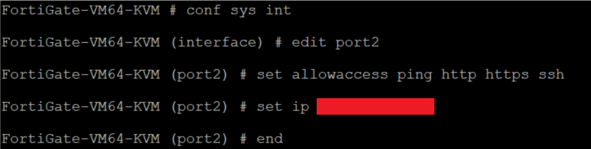

# Small Business Environment Project
## In this project I worked together with a team to build a small business environment using GNS3 via FortiClient VPN.
### Starting Topology

### Our team setup the client's network to include a LAN, Guest, and DMZ network (these networks were built on a FortiNet firewall (a FortiGate)).
### We added the following devices to the lab workspace:
1. a FortiNet firewall,
2. two Ethernet switches,
3. and a Win10 workstation.
---
### Device Topology

---
### We linked the following devices in the lab workspace:

1. WAN port on the firewall to the WAN-SWITCH,

2. LAN port on the firewall to the LAN-SWITCH,
3. DMZ port on the firewall to the DMZ-SWITCH,
4. and the Win10 workstation to the LAN-SWITCH.

---
### After setting up the client's network our team worked together to configure the LAN network by:
1. Configuring the LAN interface,

3. verifying the configuration is correct,
4. configuring the DHCP server for the LAN interface,
5. and verifying the configuration is correct.
